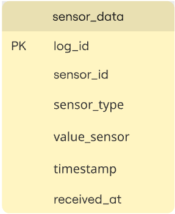

# Documentación de Proyecto IoT: Centro de Datos de Salu Conectado con MQTT y PostgreSQL

### Integrantes:
- Jeysa Nahara Blandon Martinez
- Valeria Fernanda Gustin Martinez

### Descripción del sistema
Este proyecto implementa un sistema de IoT para el sector de salud que recopila datos de sensores médicos simulados, se transmite a través de un Gateway IoT y se almacena en una base de datos PostgreSQL para su analisís. Este sistema hace uso del protocolo MQTT para la comunicación entre el Gateway y el suscriptor.

### Diagrama de la arquitectura


### Diagrama de la base de datos


### Componentes del sistema
1. ### Sensores:
    - __Sensor_1:__ Envía los datos de temperatura corporal mediante gRPC.
    - __Sensor_2:__ Envía datos de presión arterial mediante REST.
    - __Sensor_3:__ Envía datos de ritmo cardíaco mediante Websocket.

2. ### IoT_Gateway
    - Recibe los datos de los 3 tipos de sensores a través de diferentes protocolos.
    - Procesa y publica los datos mediante el servidor MQTT.

3. ### Servidor MQTT
    - En el Broker MQTT se utilizo mosquitto para que el Gateway publicara la informa de los sensores. 

4. ### Suscriptor MQTT
    - Se suscribe a lo que sea relevante.
    - Almacena los datos recibidos en PostgreSQL.

### Requisitos del sistema
- Docker
- Docker Compose
- Conexión a internet

### Puertos utilizados
- __Sensor_1(gRPC):__ Puesto 50051
- __Sensor_2(REST):__ Puerto 5000
- __Sensor_3(Websocket):__ Puerto 8765
- __IoT_Gateway:__
    - _gRPC:_ Puerto 50051
    - _REST:_ Puerto 5000
    - _Websocket:_ Puerto 8765
    - _MQTT:_ Puerto 1883
- __MQTT Broker:__ Puerto 1883

### Instrucción de despliegue
1. __Preparación del entorno__
    1. Clonar el repositorio:
        ```
        git clone [URL_repositorio]
        cd Proyecto_IoT
        ```
    2. Asegurar instalación y ejecución de Docker y Docker Compose
        ```
        docker --version
        docker-compose --version
        ```
2. __Despliegue del sistema__
    1. Iniciar la ejecución:
        ```
        docker-compose up --build
        ```

        Se debera ver los siguientes contenedores en estado "running":

        - iot-gateway
        - sensor-websocket
        - proyecto_iot-mosquitto-1
        - proyecto_iot-postgres-1
        - sensor-grpc
        - sensor-rest
        - proyecto_iot-mqtt-subscriber-1
